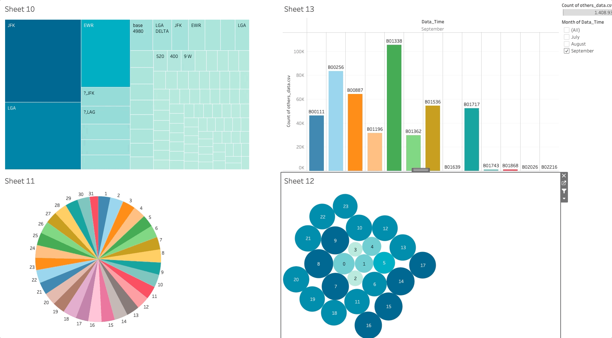

# UberAnalytics-Profit-Maximization-Strategies-for-Ride-Service-Providers

#  maximize UBER profits 

In this work, the business problem of "how to maximize profits as an Uber provider in New York" is analyzed. There are several factors that can affect an Uber provider's profit in New York, such as demand for Uber services, pricing, driver and vehicle costs, marketing strategies, and competition. To maximize profit in New York as an Uber provider, one must analyze these factors and take appropriate measures to improve the profit margin. Therefore, a thorough analysis of the different options and their effects is crucial to find the optimal solution. In addition, the following ideas were developed in this work, for example: increased demand in certain periods and the development of new business areas in the best location. It is important that these measures are coordinated and support each other in order to achieve the greatest possible profit. The "Knime Analytics Platform" tool and "Python" is used for data analysis in this thesis and the "Tableau Public" tool is used to visualize the analyzed data.

# Tableau

## Dashboard 1

This dashboard presents a comprehensive view of data with five distinct visualizations. The first chart, labeled "Years_Months," displays a comparative bar chart for the years 2014 and 2015, breaking down the count by each month. This count likely represents the volume of bets placed within those periods. The months in 2014 start from April and go through June, while 2015 shows data from January to June, with the bars representing an increasing trend in the counts as the months progress.

To the right, there is a stacked bar chart titled "Y&M Base changes" with three separate groups of bars representing the months of July, August, and September. Each bar is divided into colored segments, suggesting a comparison between 'uber' and 'others,' which could indicate a split in the counts of bets placed through Uber and other services in the given months.

Below the "Years_Months" chart, two pie charts are shown, representing data by "Days" and "Hours." These charts are color-coded and appear to distribute counts across various days of the month and hours of the day, giving insights into when bets are most frequently placed.

The last chart on the lower right is a bar chart labeled "Y&M Base," which provides a year-over-year comparison from 2014 to 2015. Similar to the first chart, this visualization displays the count, but it does so in a way that allows for direct comparison between the two years for the months of April, May, and June.

Overall, the dashboard is designed to give a detailed temporal analysis of betting activity, offering insights into monthly, daily, and hourly trends across a span of two years. The initial setup for this data visualization involved creating a formula field that organizes the data by years, months, days, and times to facilitate the creation of these charts.

## Dashboard 2

This second dashboard offers a multifaceted analysis of transportation data, likely representing service usage in a specific urban area. The main feature is a geographical map labeled simply as "Map." It employs a coordinate system using latitude and longitude to pinpoint precise locations where services have been used. The map is populated with two sets of colored dots—orange for Uber and blue for another unspecified service—indicating the distribution of service usage across the city.

Adjacent to the map, there's a bar chart titled "Sheet 7," which seems to follow the pattern established in the previous dashboard. It provides a month-over-month comparison of counts, this time for the year 2014, from April to September. The counts increase progressively from April to September, suggesting a growing trend in service usage.

The bottom portion of the dashboard includes two charts related to temporal data analysis. The pie chart, similarly to the one in the first dashboard, appears to break down the counts of service usage by day of the month. This could offer insights into peak days for service demand.

Moreover, there's a unique bubble chart representing different hours of the day, where the size of each bubble corresponds to activity levels during that hour—the larger the bubble, the more active the hour.

Interactivity seems to be a key feature of this dashboard. Selecting a month from the bar chart dynamically adjusts the pie chart and bubble chart, thereby correlating the data and providing a focused view of daily and hourly patterns for the selected month. Additionally, the map would reflect the intensity of service use in various parts of the city, highlighting areas with higher demand. The dashboard, therefore, provides a comprehensive tool for analyzing service usage patterns in both spatial and temporal dimensions

## Dashboard 3

This third dashboard focuses on analyzing pickup data, likely for a ride-hailing service, across various dimensions such as location, time, and operational bases.

The initial visualization, named "Sheet 10," is a treemap that displays the 100 most prominent pickup locations. The size of each rectangle within the treemap correlates with the importance or frequency of pickups at each location—larger rectangles signify more active locations, while smaller ones indicate less frequent pickup activity. The locations are labeled with codes such as JFK, EWR, and LGA, which could correspond to airport designations.

Directly below "Sheet 10," there is a pie chart labeled "Sheet 11." This chart continues the temporal analysis seen in previous dashboards, breaking down service usage by days of the month. Each slice of the pie chart is color-coded, providing a visual representation of the distribution of pickups across the days.

Next to the pie chart, the "Sheet 12" bubble chart visualizes hourly activity, where each bubble corresponds to an hour of the day. The size of the bubbles is indicative of the level of activity during that particular hour—larger bubbles suggest higher service use, whereas smaller bubbles suggest lower activity levels.

The last visualization on this dashboard is a bar chart titled "Sheet 13," which breaks down counts by various base codes such as B01338, B00256, etc. Each base is represented by a different color, and the height of the bar reflects the count of activities or pickups attributed to that base for the month of September, as indicated by the "Data_Time" label.

In the top right corner of the dashboard, there is a filter for the "Month of Data_Time," allowing for a granular analysis based on the selected month. The filter options include July, August, and September, hinting at the dashboard’s capability to dynamically adjust the data displayed across all charts based on the month chosen.

The arrangement and design of the dashboard provide a multifaceted view of the service's operations, emphasizing location and time-based patterns that could be vital for decision-making and resource allocation within the service provider's operations.

# Analytics with Knime

Knime was used to standardize and organize the data formats. The data was initially divided into two main groups. The first group consists of information containing written addresses. This includes 9 of the 19 CSV data offered.

 

-----------------------
The second group, on the other hand, is those who do not have a printed address, but longitude and latitude.

-------------

However, some of the information containing a written address is split into multiple columns, while other data contains the entire address in a single column. Therefore, the data where the addresses are split has been adjusted so that all columns are combined into a single column to maintain a consistent format.

The Column Combiner Knime node is used for this. As the name suggests, this node creates a single column from several columns.

------------------------

The following action consists of changing the date format of all data, regardless of the group. The new format is created by splitting the data into individual columns. This idea is used to split all data into different columns, as some of the data also contains the pick-up time in addition to the date.

-----------------------------

Knime is used to achieve this with the help of 2 nodes. The first node is called the cell splitter. Using a separator selected by the user, this node splits the content of a selected column into parts. The automatically generated column names of the previous node are then changed to "M" for months, "D" for days and "Y" for years using the Column Rename node.
The next step is to design a common syntax for the time format for all data, as the time format is different in the given data. The H:mm format is used as the seconds are not important for the analysis. The String to Date&Time node is used for this purpose.
The dates and times for all the given data are converted in the way described above to obtain a single syntax at the end. Then the data within each group is concatenated using a node called Concatenate. In the meantime, a new column is added for each category. The name of the column is TYPE . This column should be used to determine. 

-------------------------------

Responsibility for the pick-up lies with either Uber or a different ride service provider. Initially, two files are generated containing all except two of the 19 specified tables, due to an exception. Subsequently, the CSV Writer node is employed to export these two datasets as CSV files. The first file, named others_data.csv, includes data for the group identified by the addresses in the 'PICK UP ADDRESS' column.

-------------------------------
Latitude and longitude are contained in the second file, uber_lyft_data.csv.

------------------------------------

The pickups are analyzed by location using the two output files. To examine the pickups by date and time, the next goal is to aggregate all the data. The data could be grouped as the addresses are no longer needed, and as none of the data has been grouped previously, a new column called count is introduced, with the number 1 appearing in each row. This is done in order to be able to use the GroupBY node. This node is used to add up the pick-ups carried out by the same dispatcher on the same day and at the same time. Of the 19 data, 2 are used, as previously indicated. The main reason for this is that they all omitted the pick-up address information. However, as the address is no longer required, it could be included. The two leftmost pieces of data are then filtered by changing their date and time format to match the rest of the data. Once all the data had been combined into a single table, it was exported into two separate files, as one of the files was missing the collection time. The first file, all_data_without_time.csv, contains all the data after combining all the tables, but only one time column is missing.

The second file, all_data.csv, contains all the data together with the pick-up time.

